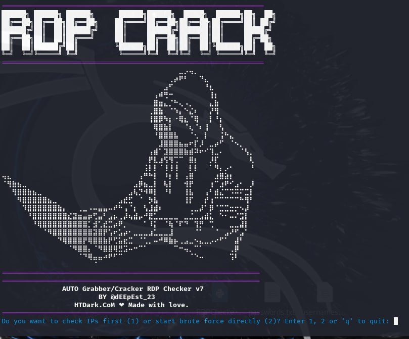

# AUTO Grabber Cracker RDP Checker v7

RDP Checker v7 is an advanced script designed to perform RDP brute-force attacks using tools like Hydra or Ncrack. It includes a comprehensive IP checker and credentials validation mechanism, ensuring efficiency and performance during penetration testing activities.

**DISCLAIMER: This tool is for educational purposes only. Unauthorized use against any system is illegal. Use it responsibly.**

---
## Screeshot



## Demonstration Video

You can watch the demonstration video in our Telegram group:

[](https://t.me/LvL23HT_GROUP/400)

---

## Features

- **Auto Grabber**: Automatically grabs IP ranges based on selected countries.
- **Port and Credentials Validation**: Checks if RDP port 3389 is open and validates if the server requests credentials.
- **Brute Force**: Supports both Hydra and Ncrack for brute-forcing credentials.
- **Compatibility**: Works only on Linux.
- **Detailed Reporting**: Generates logs for successful and failed attempts.

---

## Installation

### Prerequisites
- Python 3.10 or above
- Required Python libraries: Install via `./setup.sh`
- External tools: Hydra, Ncrack

### Installation Steps

1. Clone the repository:
    ```bash
    git clone https://github.com/your-username/rdp-checker.git
    cd rdp-checker
    ```

2. We set permissions:
    ```bash
    chmod +x setup.sh
    chmod +x RDPChecker7
    ```

3. We run the dependency installer and RDPChecker7:
    - **Linux**:
        ```bash
        ./setup.sh
        ./RDPChecker7
        ```
    - **Windows**:
        - Not supported. You will need to run it on WSL
          ```bash
          wsl --install
          ```

---

## Usage

### 1. Check IPs
- Grab IP ranges based on country selection.
- Validate if RDP port 3389 is open and if credentials are requested.

### 2. Start Brute Force
- Choose between Hydra or Ncrack for brute force attacks.
- Provide the path to username and password files.


---

## Example Commands

### Running Hydra (from CLI):
```bash
hydra -o cracked.txt -V -f -t 1 -W 5 -l admin -p password123 rdp://192.168.1.100
```
### Running Ncrack (from CLI):
```bash
ncrack -p 3389 --user admin --pass password123 192.168.1.100
```

---
## Contribution
Contributions are welcome! Feel free to fork the project and submit pull requests. Ensure your code adheres to the existing style and includes appropriate documentation.


